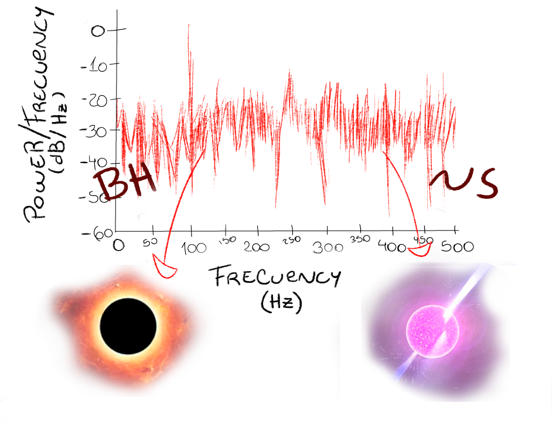

<a name="readme-top"></a>

<!-- PROJECT SHIELDS -->
<!--
*** I'm using markdown "reference style" links for readability.
*** Reference links are enclosed in brackets [ ] instead of parentheses ( ).
*** See the bottom of this document for the declaration of the reference variables
*** for contributors-url, forks-url, etc. This is an optional, concise syntax you may use.
*** https://www.markdownguide.org/basic-syntax/#reference-style-links
-->
[![Contributors][contributors-shield]][contributors-url]
[![Forks][forks-shield]][forks-url]
[![Stargazers][stars-shield]][stars-url]
[![Issues][issues-shield]][issues-url]
[![GNU GPLv3 License][license-shield]][license-url]


<!-- PROJECT LOGO -->
<br />
<div align="center">
  <a href="https://github.com/Emmatassone/power-spectrum-classification/README.md">
    
  </a>

  <h3 align="center">Power-spectrum-classificator</h3>

  <p align="center">
    Machine Learning techniques that classificate Black hole or Neutron star power spectra.
    <br />
    <a href="https://github.com/Emmatassone/power-spectrum-classification/issues">Report Bug</a> 
  </p>
</div>


<!-- TABLE OF CONTENTS -->
<details>
  <summary>Table of Contents</summary>
  <ol>
    <li>
      <a href="#about-the-project">About The Project</a>
      <ul>
        <li><a href="#built-with">Built With</a></li>
      </ul>
    </li>
    <li>
      <a href="#getting-started">Getting Started</a>
      <ul>
        <li><a href="#prerequisites">Prerequisites</a></li>
      </ul>
    </li>
    <li><a href="#usage">Usage</a></li>
    <li><a href="#roadmap">Roadmap</a></li>
    <li><a href="#contributing">Contributing</a></li>
    <li><a href="#license">License</a></li>
    <li><a href="#contact">Contact</a></li>
  </ol>
</details>


<!-- ABOUT THE PROJECT -->
## About The Project

power-spectrum-classification is a project focused on automating the classification of power spectra sources.


<p align="right">(<a href="#readme-top">back to top</a>)</p>


### Built With

The project is built with python, with the help of the following libraries.

* [![scikit-learn][scikit-learn-image]][scikit-learn-url]


<p align="right">(<a href="#readme-top">back to top</a>)</p>


<!-- GETTING STARTED -->
## Getting Started

To classificate a new source or observation, the observation file (.asc) should be placed in To_classify folder.

### Prerequisites

This is an example of how to list things you need to use the software and how to install them.
* npm
  ```sh
  npm install npm@latest -g
  ```

<!-- USAGE EXAMPLES -->
## Usage


<p align="right">(<a href="#readme-top">back to top</a>)</p>


<!-- ROADMAP -->
## Roadmap

- [ ] Add Sources
  - [ ] Black Holes
  - [ ] Neutron Stars
  - [ ] Galaxies
- [ ] Add Neural Network


<p align="right">(<a href="#readme-top">back to top</a>)</p>


<!-- CONTRIBUTING -->
## Contributing

If you have a suggestion that would make this better, please fork the repo and create a pull request. You can also simply open an issue with the tag "enhancement".
Don't forget to give the project a star! Thanks again!

1. Fork the Project
2. Create your Feature Branch (`git checkout -b feature/AmazingFeature`)
3. Commit your Changes (`git commit -m 'Add some AmazingFeature'`)
4. Push to the Branch (`git push origin feature/AmazingFeature`)
5. Open a Pull Request

<p align="right">(<a href="#readme-top">back to top</a>)</p>


<!-- LICENSE -->
## License

Distributed under the GNU GPLv3 License. See `LICENSE` for more information.

<p align="right">(<a href="#readme-top">back to top</a>)</p>


<!-- CONTACT -->
## Contact

Emmanuel A. Tassone - [@EmmanuelTassone](https://twitter.com/EmmanuelTassone) - emmanueltassone@gmail.com

Project Link: [https://github.com/Emmatassone/power-spectrum-classification](https://github.com/Emmatassone/power-spectrum-classification)

<p align="right">(<a href="#readme-top">back to top</a>)</p>


<!-- ACKNOWLEDGMENTS -->
## Acknowledgments

A special thanks should be done to the following open-source projects.

* [Img Shields](https://shields.io)
* [GitHub Pages](https://pages.github.com)

<p align="right">(<a href="#readme-top">back to top</a>)</p>


<!-- MARKDOWN LINKS & IMAGES -->
<!-- https://www.markdownguide.org/basic-syntax/#reference-style-links -->
[contributors-shield]: https://img.shields.io/github/contributors/Emmatassone/power-spectrum-classification.svg?style=for-the-badge
[contributors-url]: https://github.com/Emmatassone/power-spectrum-classification/graphs/contributors
[forks-shield]: https://img.shields.io/github/forks/Emmatassone/power-spectrum-classification.svg?style=for-the-badge
[forks-url]: https://github.com/Emmatassone/power-spectrum-classification/network/members
[stars-shield]: https://img.shields.io/github/stars/Emmatassone/power-spectrum-classification.svg?style=for-the-badge
[stars-url]: https://github.com/Emmatassone/power-spectrum-classification/stargazers
[issues-shield]: https://img.shields.io/github/issues/Emmatassone/power-spectrum-classification.svg?style=for-the-badge
[issues-url]: https://github.com/Emmatassone/power-spectrum-classification/issues
[license-shield]: https://img.shields.io/github/license/Emmatassone/power-spectrum-classification.svg?style=for-the-badge
[license-url]: https://github.com/Emmatassone/power-spectrum-classification/blob/master/LICENSE
[scikit-learn-image]: https://scikit-learn.org/stable/_static/scikit-learn-logo-small.png
[scikit-learn-url]: https://scikit-learn.org/stable/
